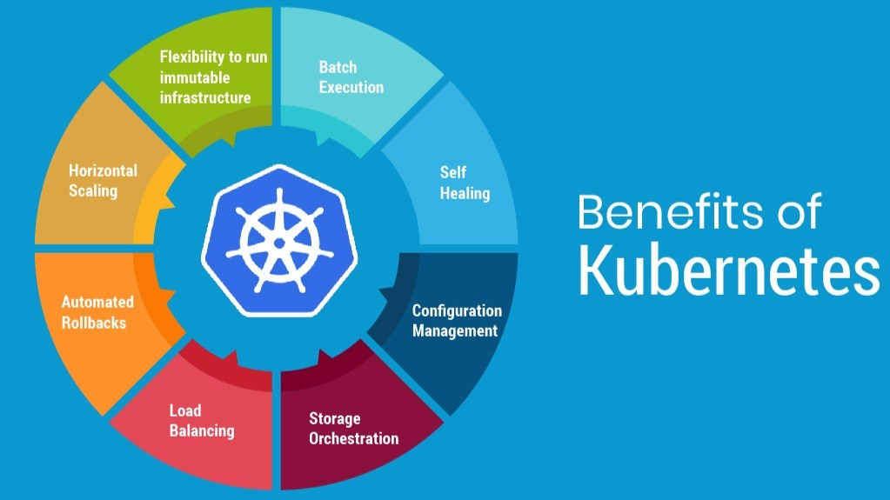
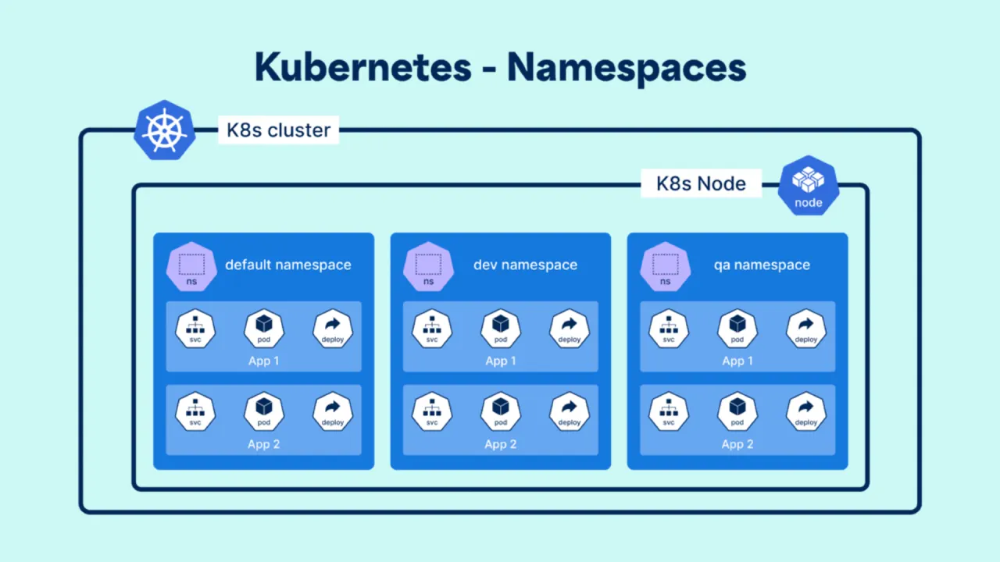
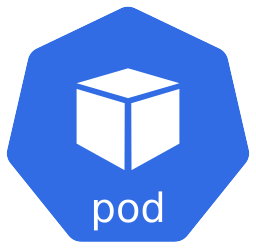
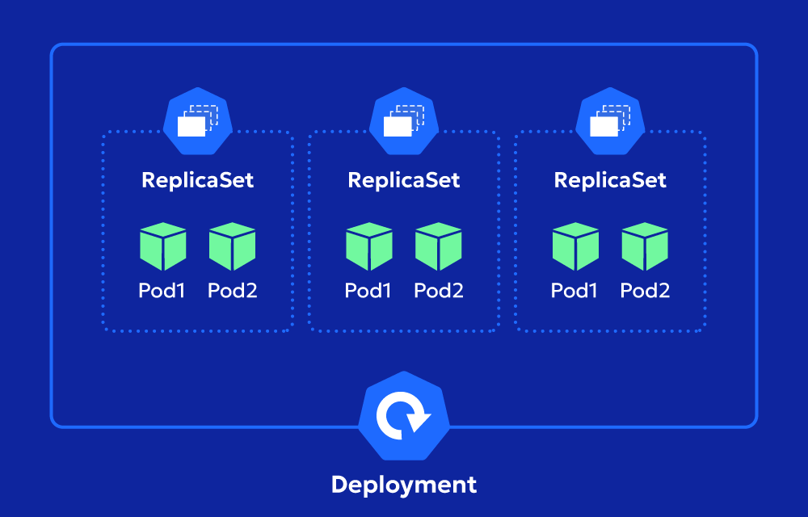
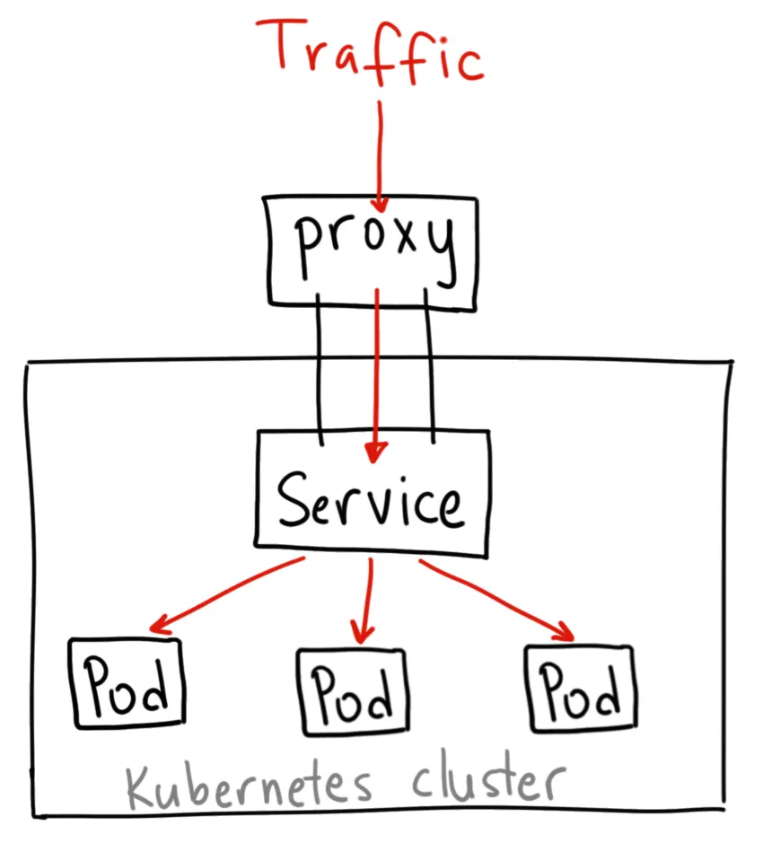
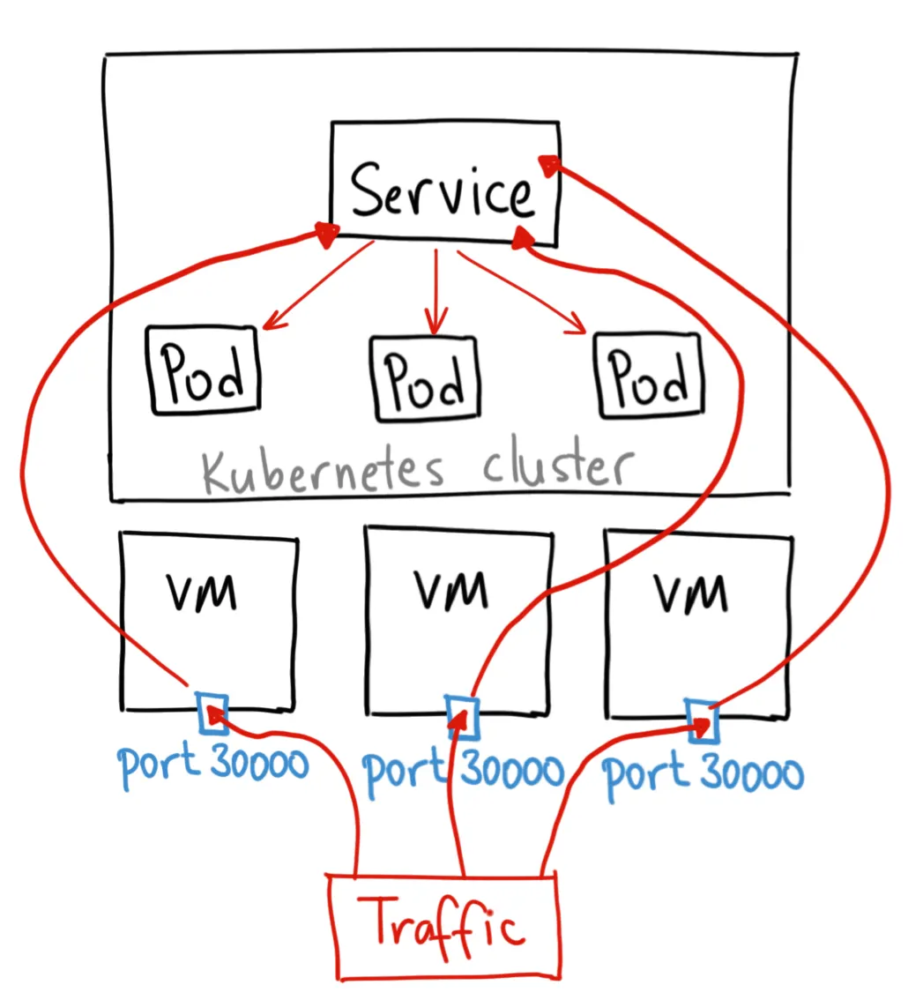
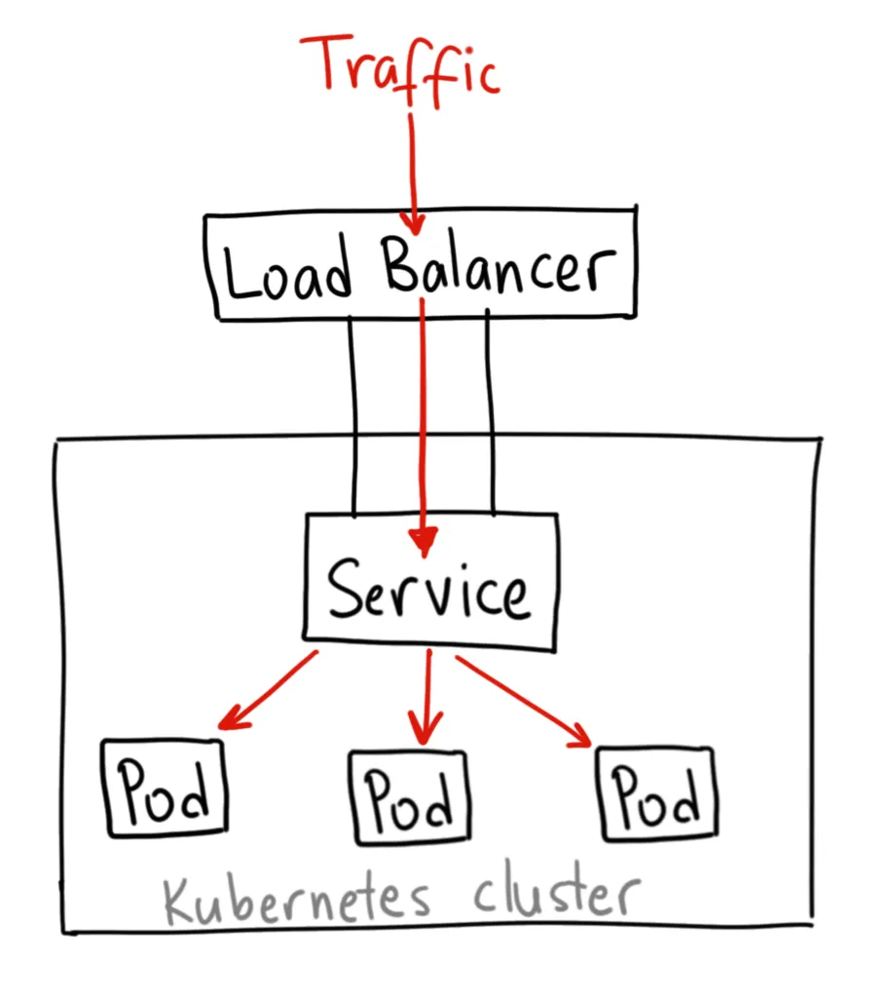
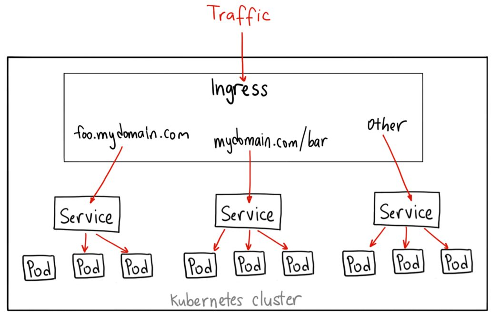
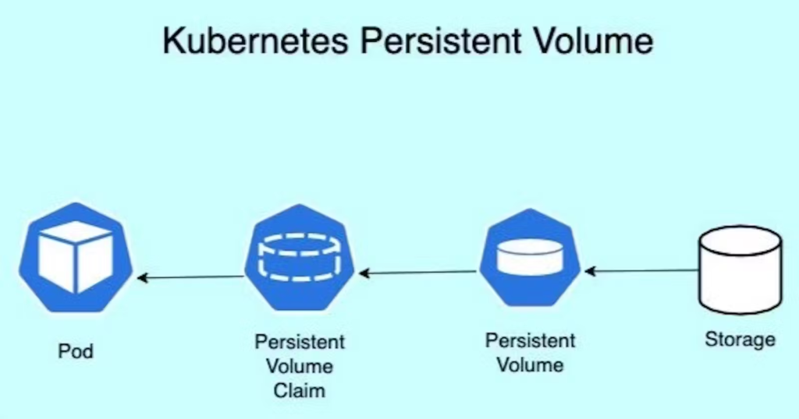

<!-- _class: lead -->

# Kubernetes 101

A beginner's guide to container orchestration

---

## Agenda

- The Problem
- What is Kubernetes?
- Cluster Structure
- Namespaces
- Pods
- ReplicaSets

---

## Agenda (cont.)

- Deployments
- Services & Networking
- ConfigMaps & Secrets
- Ingress
- Persistent Volumes
- Summary

---

<!-- _class: lead -->

# Part 1

## The Problem

---

## Life Without Kubernetes

Imagine you run a web app on a single server.

- Server crashes → app goes down
- Traffic spikes → app slows or crashes
- Update the app → downtime for users
- Add more servers → manage each one manually

> Running apps at scale by hand is painful.

---

## What We Really Want

- **High availability** — stays up even if a server dies
- **Auto-scaling** — handles traffic spikes automatically
- **Easy updates** — no downtime on deploys
- **Self-healing** — crashed processes restart themselves

---

<!-- _class: lead -->

# Part 2

## What is Kubernetes?

---

## A Quick Analogy

Think of Kubernetes like a **restaurant manager**:

- The **kitchen staff** (servers/nodes) do the actual cooking (running containers)
- The **manager** (control plane) decides who cooks what, handles rush hour, and replaces staff who call in sick
- The **menu** (your config files) describes exactly what dishes to serve

---

## Key Terms to Know

| Term | Plain meaning |
|------|--------------|
| **Cluster** | The whole Kubernetes system |
| **Node** | One machine in the cluster |
| **Control Plane** | The brain that makes decisions |
| **Workload** | An app or service running on the cluster |

---

<!-- _class: lead -->

# Part 3

## How Kubernetes is Structured

---

## The Cluster

A **cluster** is the entire Kubernetes environment.

It is made up of two types of machines:

- **Control Plane** — manages the cluster
- **Worker Nodes** — where your apps actually run

A production cluster usually has multiple worker nodes for redundancy.

---

## The Control Plane

The control plane is the "brain" of Kubernetes.

- Keeps track of what is running where
- Decides which node should run each workload
- Watches for failures and takes corrective action
- Accepts instructions from you (via config files)

You do not run your apps on the control plane — it is reserved for management.

---

## Worker Nodes

Worker nodes are the machines that actually run your containers.

Each node has:

- **kubelet** — talks to the control plane and runs containers as instructed
- **Container runtime** — the engine that runs containers (like Docker)
- **kube-proxy** — handles networking between containers

---

## How It All Fits Together

---

<!-- _class: lead -->

# Part 4

## Namespaces

---

## What is a Namespace?

A way to divide one cluster into **logical groups**.

- Teams and environments share one cluster safely
- Apply different limits and permissions per namespace
- Common: `default`, `kube-system`, `dev`, `prod`

---

## Why Namespaces Matter

Without namespaces, one big cluster becomes messy fast.

With namespaces you can:

- Let the **dev team** work freely without affecting production
- Apply different **resource limits** per environment
- Set different **access permissions** per team

> Think of namespaces like folders on a shared drive.

---

<!-- _class: lead -->

# Part 5

## Pods

---

## What is a Pod?

A **Pod** is the smallest thing Kubernetes manages.

- A Pod wraps one (or sometimes a few) containers
- All containers in a Pod share the same network and storage
- Each Pod gets its own IP address inside the cluster

> If a container is like a process, a Pod is like a small virtual machine that holds it.

---

## Pods are Temporary

Pods are not meant to live forever.

- If a Pod crashes, Kubernetes creates a new one in its place
- The new Pod gets a **different IP address**
- You should never rely on a specific Pod being there

This is why we use higher-level objects (Deployments, Services) to manage Pods.

---

## When Would You Have Multiple Containers in One Pod?

Usually one container per Pod is the right choice.

Multi-container Pods make sense when containers are tightly coupled:

- A **log collector** that reads files written by the main app
- A **proxy sidecar** that handles network traffic for the main app

These are called **sidecar patterns**.

---

<!-- _class: lead -->

# Part 6

## ReplicaSets

---

## What is a ReplicaSet?

A **ReplicaSet** ensures that a specific number of identical Pods are always running.

- You say "I want 3 copies of this Pod"
- ReplicaSet watches and maintains exactly that number
- A Pod dies → ReplicaSet immediately starts a replacement

---

## ReplicaSet in Practice

| Situation | What happens |
|-----------|-------------|
| Pod crashes | ReplicaSet starts a new one |
| Pod is deleted | ReplicaSet starts a new one |
| Node dies | Pods move to healthy nodes |
| You scale to 5 | ReplicaSet starts 2 more |

> You rarely create a ReplicaSet directly — Deployments do it for you.

---

<!-- _class: lead -->

# Part 7

## Deployments

---

## What is a Deployment?

A **Deployment** is the standard way to run your app in Kubernetes.

It manages ReplicaSets for you and adds:

- **Rolling updates** — replace old Pods with new ones gradually, no downtime
- **Rollback** — go back to a previous version if something breaks
- **Scaling** — increase or decrease the number of running Pods

---

## Rolling Updates Explained

When you push a new version of your app:

1. Kubernetes starts a new Pod with the new version
2. Once it is healthy, it removes one old Pod
3. Repeat until all Pods are updated
4. Users never see downtime

> Old version and new version run side by side briefly during the update.

---

## Deployment → ReplicaSet → Pod

Old ReplicaSets are kept for instant rollback.

---

<!-- _class: lead -->

# Part 8

## Services & Networking

---

## The Problem with Pod IPs

Pods are temporary. Their IP addresses change every time they restart.

If Service A needs to talk to Service B, it cannot rely on a fixed IP.

**Solution: a Service**

A Service is a stable address that always points to the right Pods, no matter how many times they restart.

---

## What is a Service?

A **Service** sits in front of a group of Pods and gives them a stable name and address.

- Pods come and go — the Service stays
- Automatically load-balances traffic across all healthy Pods
- Uses **labels** to know which Pods belong to it

---

## Three Types of Service

| Type | Who can reach it | Use case |
|------|-----------------|---------|
| **ClusterIP** | Only inside the cluster | Service-to-service communication |
| **NodePort** | Anyone on the network via node IP | Dev/testing, simple external access |
| **LoadBalancer** | Public internet | Production external traffic |

---

## ClusterIP

The default Service type.

- Stable internal address only
- Not reachable from outside the cluster
- Ideal for internal microservices

---

## NodePort

Opens a port on every worker node.

- Port range: 30000–32767
- Good for dev/testing or on-premise
- Not recommended for production

---

## LoadBalancer

Provisions a cloud load balancer with a public IP.

- Works on AWS, GCP, Azure
- Internet → Load Balancer → Pods
- Recommended for production public traffic

---

<!-- _class: lead -->

# Part 9

## ConfigMaps & Secrets

---

## Why Separate Config from Code?

Hard-coding settings inside your app image is a bad idea:

- Different environments (dev/prod) need different values
- Changing a setting forces you to rebuild the image
- Sensitive values (passwords) should never be baked into an image

Kubernetes solves this with **ConfigMaps** and **Secrets**.

---

## ConfigMap

A **ConfigMap** stores non-sensitive configuration as key-value pairs.

Examples of what to store:
- `APP_ENV = production`
- `LOG_LEVEL = info`
- `API_BASE_URL = https://api.example.com`

Pods can read ConfigMap values as environment variables or mounted files.

The same app image runs in dev and prod — only the ConfigMap changes.

---

## Secret

A **Secret** is like a ConfigMap but designed for sensitive data.

Examples of what to store:
- Database passwords
- API keys
- TLS certificates

Important things to know:
- Values are **base64-encoded** by default (not encrypted at rest unless configured)
- Kubernetes keeps Secrets separate from regular config to control access
- Never commit Secret values to your source code repository

---

## ConfigMap vs Secret

| | ConfigMap | Secret |
|--|-----------|--------|
| **Purpose** | Non-sensitive config | Sensitive credentials |
| **Encoding** | Plain text | Base64 |
| **Access control** | Standard | Tighter by default |
| **Examples** | Log level, env name | Passwords, tokens |

---

<!-- _class: lead -->

# Part 10

## Ingress

---

## The Problem with Many Services

Imagine you have three apps:

- `api.example.com` → API service
- `app.example.com` → Frontend service
- `app.example.com/admin` → Admin service

With LoadBalancer Services alone, you would need one public IP per service. That gets expensive and messy fast.

**Solution: Ingress**

---

## What is Ingress?

An **Ingress** is a single entry point that routes incoming HTTP/HTTPS traffic to the right Service based on rules.

- One public IP for many services
- Routes by hostname (`api.example.com`) or path (`/admin`)
- Handles TLS/HTTPS termination in one place

> Think of Ingress like a receptionist — one front desk that directs visitors to the right department.

---

## How Ingress Works

---

## Ingress Controller

An Ingress resource alone does nothing — you also need an **Ingress Controller** running in the cluster.

Popular controllers:

| Controller | Common use case |
|-----------|----------------|
| **nginx** | Most common, works everywhere |
| **Traefik** | Cloud-native, automatic TLS |
| **AWS ALB** | Native AWS Application Load Balancer |
| **GCE** | Native Google Cloud |

The controller is what actually processes and applies the routing rules.

---

## Ingress vs LoadBalancer

| | LoadBalancer | Ingress |
|-|------------|--------|
| **IP addresses** | One per Service | One shared |
| **Routing** | Port only | Host + path |
| **TLS** | Per service | Centralized |
| **Cost** | Higher (more IPs) | Lower |
| **Best for** | Simple / non-HTTP | Multiple HTTP services |

---

<!-- _class: lead -->

# Part 11

## Persistent Volumes

---

## The Problem with Container Storage

Containers (and Pods) have ephemeral storage by default.

- Pod restarts → all files written to the container are gone
- This is fine for stateless apps (web servers, APIs)
- This is a problem for stateful apps (databases, file uploads)

> A database that loses all its data on restart is not very useful.

---

## What is a Persistent Volume?

A **Persistent Volume (PV)** is a piece of storage that exists independently of any Pod.

- Lives beyond the lifetime of a Pod
- Can be backed by a cloud disk, NFS, local disk, etc.
- When a Pod dies, the data stays — the next Pod picks it up

---

## Three Storage Concepts

| Concept | What it is |
|---------|-----------|
| **PersistentVolume (PV)** | The actual storage resource (provisioned by admin or cloud) |
| **PersistentVolumeClaim (PVC)** | A request for storage by an app (how much, what type) |
| **StorageClass** | A template that defines how storage is provisioned automatically |

---

## PersistentVolumeClaim in Plain English

Your app does not ask for a specific disk by name. Instead it makes a **claim**:

> "I need 10GB of fast storage."

Kubernetes finds a matching PersistentVolume (or creates one via StorageClass) and binds it to your Pod.

- The app just sees a folder it can read and write
- The underlying disk type (SSD, HDD, cloud) is an infrastructure detail

---

## How It All Connects

Pod restarts reattach to the same PV — data stays intact.

---

## StorageClass

A **StorageClass** lets Kubernetes provision storage automatically when a claim is made.

Without StorageClass: an admin must manually create each PersistentVolume before any app can use it.

With StorageClass: the app asks for storage → Kubernetes provisions it automatically from the cloud.

Common StorageClasses:

- **standard** — general purpose (slower, cheaper)
- **premium / ssd** — fast SSD storage (for databases)

---

## When Do You Need Persistent Volumes?

| App type | Need PV? |
|---------|---------|
| Web server (stateless) | No |
| REST API (stateless) | No |
| Database (MySQL, Postgres) | Yes |
| File storage / uploads | Yes |
| Message queue with persistence | Yes |

A good rule: if losing the data on restart would be a problem, use a PersistentVolume.

---

<!-- _class: lead -->

# Part 12

## Summary

---

## What We Covered

| Concept | One-line summary |
|---------|-----------------|
| **Kubernetes** | Manages containers across many machines |
| **Node** | A machine in the cluster |
| **Namespace** | Logical grouping inside a cluster |
| **Pod** | One or more containers running together |
| **ReplicaSet** | Keeps N copies of a Pod alive |
| **Deployment** | Manages updates and rollbacks |
| **Service** | Stable address in front of Pods |
| **ConfigMap** | Non-sensitive app configuration |
| **Secret** | Sensitive credentials |
| **Ingress** | Routes HTTP traffic to many services |
| **PersistentVolume** | Storage that survives Pod restarts |

---

## Key Ideas to Remember

- Kubernetes manages **desired state** — you say what you want, it makes it happen
- Pods are **temporary** — always use a Deployment to manage them
- Services give Pods a **stable address** that survives restarts
- Use **Ingress** to route multiple HTTP services through one entry point
- Keep config **outside** your image with ConfigMaps and Secrets
- Use **PersistentVolumes** whenever your app needs to keep data across restarts

---

<!-- _class: lead -->

# Next Steps

Try Kubernetes in your browser at **killercoda.com** or **play-with-k8s.com**

Explore next: Helm, StatefulSets, RBAC, HorizontalPodAutoscaler
